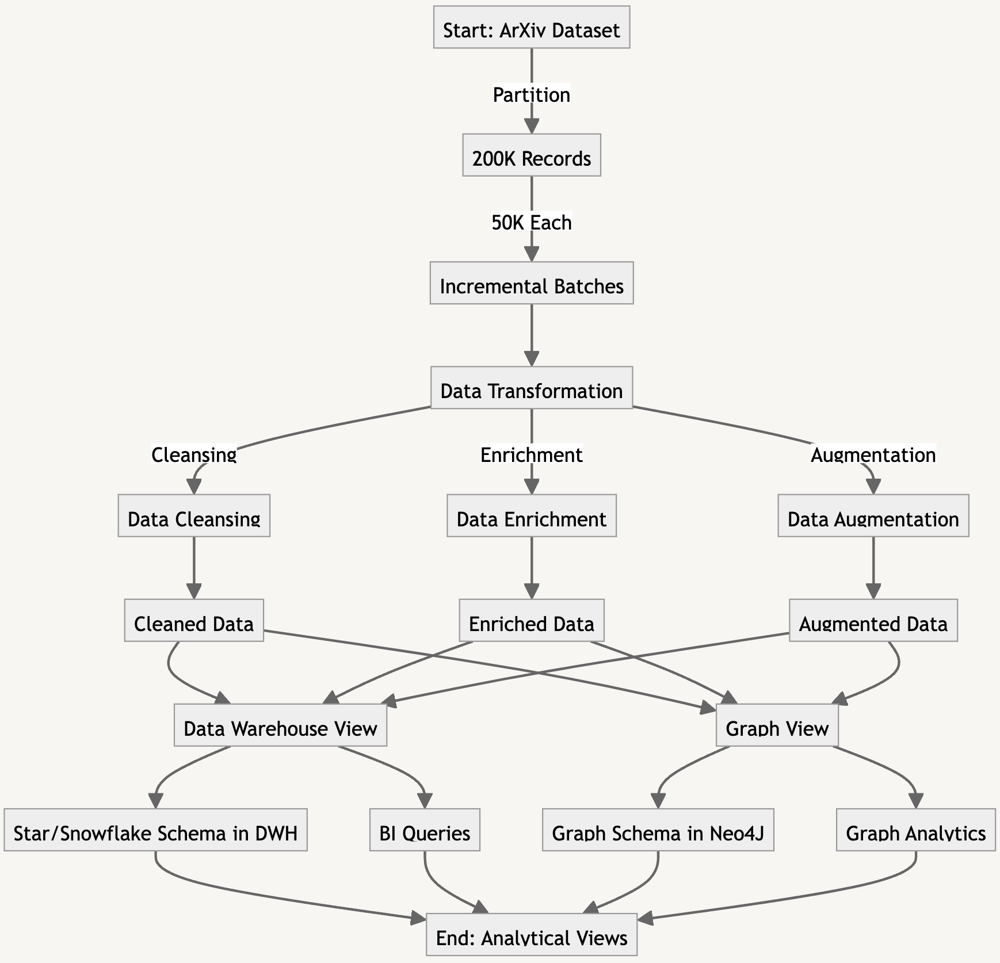

# Scientific Publications Data Analysis

## Project Description

This repository contains work focusing on scientific publications' data engineering and analytics. Our project utilizes the ArXiv dataset to build multifaceted analytical views and ensure repeatability in data processing.

## Dataset

- **Source**: ArXiv dataset from Kaggle.
- **Scope**: The dataset includes 200K records, partitioned for incremental updates.

## Technologies Used

- **Data Warehouse**: PostgreSQL for RDBMS.
- **Graph Database**: Neo4J.
- **Additional Tools**: Scholar.py, Crossref API, etc., for data enrichment.

## Schema Design

### Data Warehouse View (DWH)

- **Schema Type**: Star/Snowflake Schema.
- **Dimensions**: Authors, Publication Venues, Scientific Domain, Year of Publication, Authors' Affiliation.
- **Fact Table**: Records various dimension combinations.

### Graph View

- **Nodes**: Authors, Papers, Journals, Affiliations.
- **Relationships**: Authorship, Co-authorship, Works-for, Cites.

## Analytics Tasks

- Finding influential papers using PageRank.
- Detecting communities with strongly connected components.
- BI Queries and Analytics are used to generate analytical views.

## Data Transformation and Cleansing

- Enriching the dataset with citation information.
- Resolving ambiguous author names and publication venues.
- Normalizing the field of study using classification tables.

## Project Roadmap

We have detailed steps and tasks for each project phase, including data acquisition, transformation, database schema design, analytics, and reporting.

## Potential Pipeline

## Conclusion

This project aims to provide comprehensive insights into scientific publications through robust data engineering and analytical techniques. Our process is designed for repeatability and scalability, accommodating incremental updates.

## Team Members

- [Jekaterina Bossenko](mailto:jekaterina.bossenko@ut.ee)
- [Viktor Oleksandr Mansilla Alvarez](mailto:viktor.oleksandr.mansilla.alvarez@ut.ee)
- [Samir Musali](mailto:samir.musali@ut.ee)
- [Aleksandra Rammul](mailto:aleksandra.rammul@ut.ee)

## License

Note that we use a standard [MIT](./LICENSE) license on this repo.

## Contributing

Contributions are always welcome. See the [contributing guide](/CONTRIBUTING.md) to learn how you can help.

---

University of Tartu, 2023
