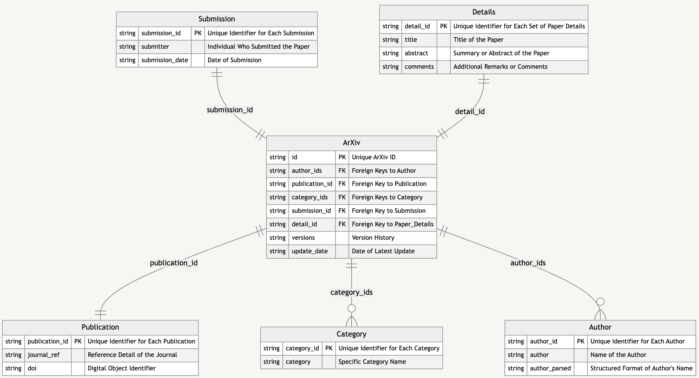

# Data Warehouse Schema Design

## Overview

This document outlines the design of a Data Warehouse (DWH) schema for the arXiv dataset, employing a Star Schema model tailored for a PostgreSQL RDBMS. The design aims to organize the dataset into a central fact table and associated dimension tables, enabling efficient data analysis and query processing.

## Fact Table: Paper

The Paper table is the core of this DWH schema, containing the transactional metadata of each paper in the dataset:

- **id (Primary Key)**: The unique arXiv ID assigned to each paper.
- **author_ids**: Foreign Keys linking to the Author dimension table (as there can be multiple authors for a paper, this could be an array of author_id or a similar structure).
- **publication_id**: Foreign Key linking to the Publication dimension table.
- **category_ids**: Foreign Keys linking to the Category dimension table (since a paper can have multiple categories, this could be an array of category_id or similar).
- **submission_id**: Foreign Key linking to the Submission dimension table.
- **detail_id**: Foreign Key linking to the Details dimension table.
- **versions**: The version history of the paper.
- **update_date**: The date of the most recent update to the paper.

## Dimension Tables

Dimension tables store descriptive attributes, providing context to the data in the fact table:

### Dimension: Author
- **author_id (Primary Key)**: A unique identifier for each author.
- **author_parsed**: Structured format of the author's name (derived from `authors_parsed` and `authors` fields).

### Dimension: Publication
- **publication_id (Primary Key)**: A unique identifier for each publication.
- **journal_ref**: The reference detail of the journal.
- **doi**: Digital Object Identifier of the publication.

### Dimension: Category
- **category_id (Primary Key)**: A unique identifier for each category.
- **category**: Specific category name (derived from `categories`).

### Dimension: Submission
- **submission_id (Primary Key)**: A unique identifier for each submission.
- **submitter**: Individual who submitted the paper.
- **submission_date**: Date of submission (derived from `update_date`).

### Dimension: Details
- **detail_id (Primary Key)**: A unique identifier for each set of paper details.
- **title**: Title of the paper.
- **abstract**: Summary or abstract of the paper.
- **comments**: Additional remarks or comments on the paper.

## Relationships

Each record in the Paper table is linked to the dimension tables via foreign keys. The id field in Paper serves as a reference to associate each paper with corresponding records in dimension tables like Author, Publication, Category, Submission, and Details.

This Star Schema design for the arXiv dataset facilitates a structured and efficient approach to querying and analyzing the dataset. It aligns with the principles of data warehousing and is optimized for implementation in a PostgreSQL environment. The schema design effectively separates transactional data (in the fact table) from descriptive attributes (in the dimension tables), enhancing the clarity and accessibility of the data.