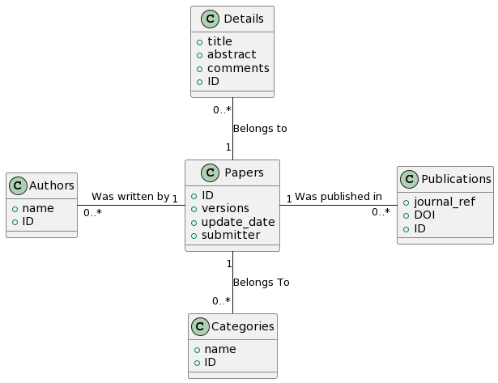

# Graph Database Schema Design

## Overview
The graph database follows a similar pattern to the DWH design logic but is structured differently, which makes it more flexible and adaptable to changes in the design. The schema is designed to manage and analyze the arXiv dataset effectively, leveraging the flexibility and adaptability of graph databases.

## Nodes
The schema incorporates several key entities, each represented as a node in the Neo4J graph database:
- **Papers**: Central entities representing academic papers.
- **Authors**: Individuals who have authored the papers.
- **Categories**: Various categories under which the papers are classified.
- **Publications**: Journals or publications where the papers are published.
- **Details**: Additional details associated with each paper.

## Relationships
The schema defines essential relationships between the nodes, enhancing data connectivity and analysis capabilities:
- **Paper to Author**: "Was written by", which links papers to their respective authors.
- **Paper to Category**: "Belongs To", which categorizes each paper into one or more classifications.
- **Paper to Publication**: "Was published in", which associates papers with the publications where they appeared.
- **Detail to Paper**: "Belongs to", which connects detailed information to the respective papers.

## Attributes
Specific attributes, providing detailed information, characterize each node in the schema:
- **Paper**: ID, versions, update_date, submitter
- **Detail**: title, abstract, comments, ID
- **Author**: name, ID
- **Category**: name, ID
- **Publication**: journal_ref, DOI, ID

## Additional Notes
- The graph database schema is noted for its flexibility, particularly compared to the Data Warehouse (DWH) design described in the report.
- The schema aligns with data warehousing principles but is optimized for a graph database context, offering enhanced adaptability for complex data relationships.